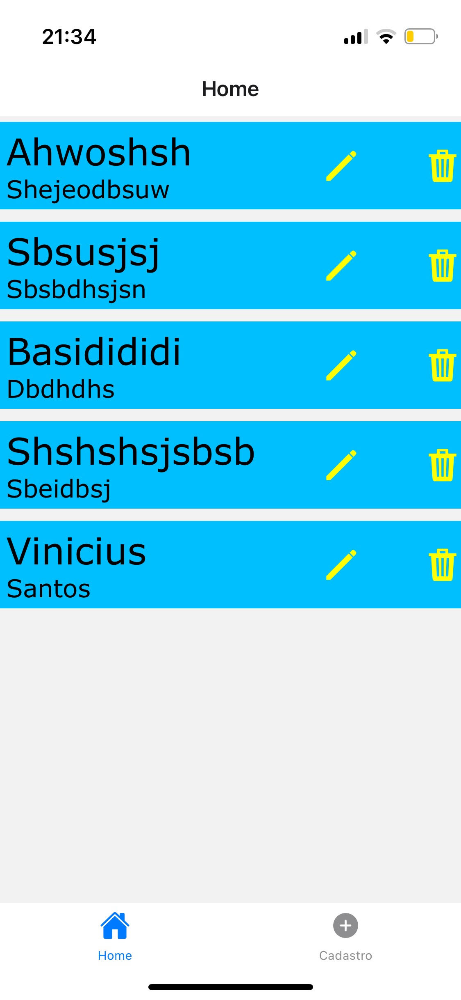

# Sobre o projeto
Projeto em react-native que realiza cadastro, edição, listamento e remorção de dados usando a dependência async-storage

## 🛠️ Construído com

React-native 
javaScript e typeScript

## tela home:

